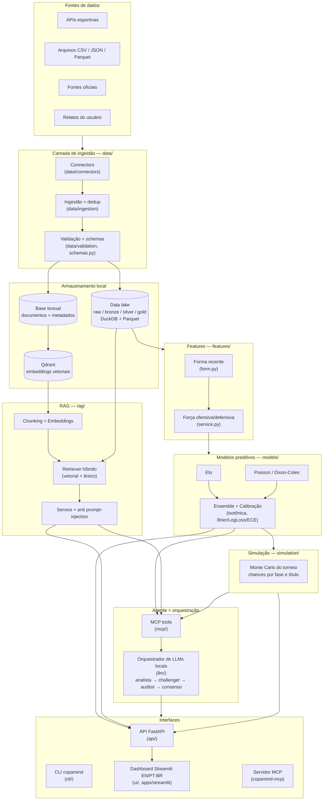
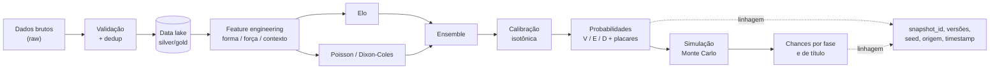
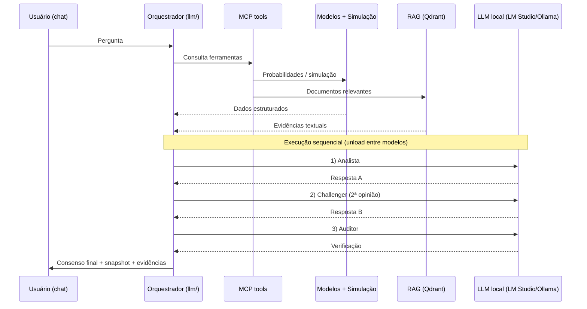
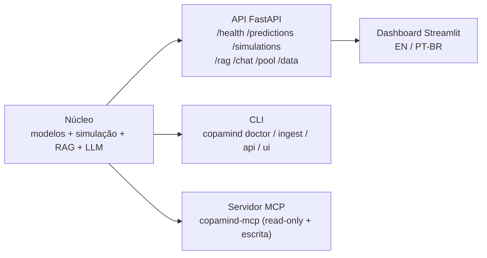

# Arquitetura — CopaMind 2026

> Documento vivo. Descreve a arquitetura de alto nível, os módulos e os fluxos de dados do CopaMind 2026.
> Diagramas em [Mermaid](https://mermaid.js.org/) — renderizam automaticamente no GitHub e no VS Code.

**Princípio central:** o LLM **não produz** a probabilidade. As probabilidades vêm de modelos estatísticos/ML calibrados (Elo, Poisson/Dixon-Coles, ensemble, Monte Carlo). Os LLMs apenas **interpretam, consultam e explicam** — sempre com linhagem e reprodutibilidade.

---

## 1. Visão geral em camadas

---

## 2. Fluxo de uma previsão (pipeline preditivo)

Separa claramente **dados estruturados** (probabilidades) de **dados textuais** (explicação via RAG/LLM).

---

## 3. Orquestração sequencial de LLMs locais

Restrição de hardware (8 GB VRAM): os modelos rodam **um de cada vez**, com *unload* entre eles. O LLM nunca gera a probabilidade — ele consome os resultados dos modelos + RAG e produz interpretação auditável.

---

## 4. Mapa de módulos (`src/copamind/`)

| Módulo | Responsabilidade |
|--------|------------------|
| `core/` | Configuração (`config.py`) e logging estruturado (`logging.py`) |
| `data/` | Connectors, ingestão, validação, schemas e repositórios (DuckDB/Parquet) |
| `features/` | Forma recente e força ofensiva/defensiva pré-jogo |
| `models/` | `elo/`, `poisson/`, `ensemble/`, `calibration/` |
| `simulation/` | Simulação Monte Carlo do torneio |
| `rag/` | Chunking, embeddings, retriever híbrido, store (Qdrant) e service |
| `llm/` | Cliente, contratos, hardware, orquestrador e benchmark de LLMs locais |
| `mcp/` | Servidor MCP e ferramentas expostas ao agente/IDE |
| `pool/` | Bolão de IAs locais: preditores, scoring e leaderboard |
| `content/` | Cards e conteúdo derivado |
| `reports/` | Relatórios e extratores |
| `api/` | FastAPI: rotas `health`, `data`, `predictions`, `simulations`, `rag`, `chat`, `pool`, `user_reports` |
| `cli/` | Comando `copamind` (`main.py`, `doctor.py`) |
| `ui/` | Dashboard bilíngue (EN/PT-BR) em Streamlit |

---

## 5. Superfícies de interface

---

## 6. Reprodutibilidade e linhagem

Todo resultado (previsão, simulação ou resposta de chat) registra:

- `snapshot_id` e versão do dataset;
- versão das features e do modelo;
- parâmetros e `seed`;
- data/hora e origem dos dados;
- LLMs utilizados, prompts e documentos recuperados;
- tempos de execução.

Isso garante que qualquer resposta possa ser **auditada e reproduzida** — princípio inegociável do projeto.

---

## Referências

- Plano completo: [CopaMind_2026_MASTER_PLAN.md](CopaMind_2026_MASTER_PLAN.md)
- Decisões arquiteturais: [DECISIONS.md](DECISIONS.md)
- Backlog: [TASKS.md](TASKS.md) · Cronograma: [ROADMAP.md](ROADMAP.md)
