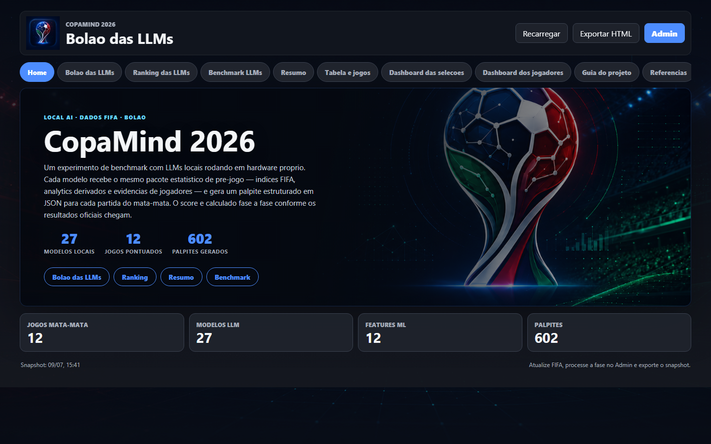
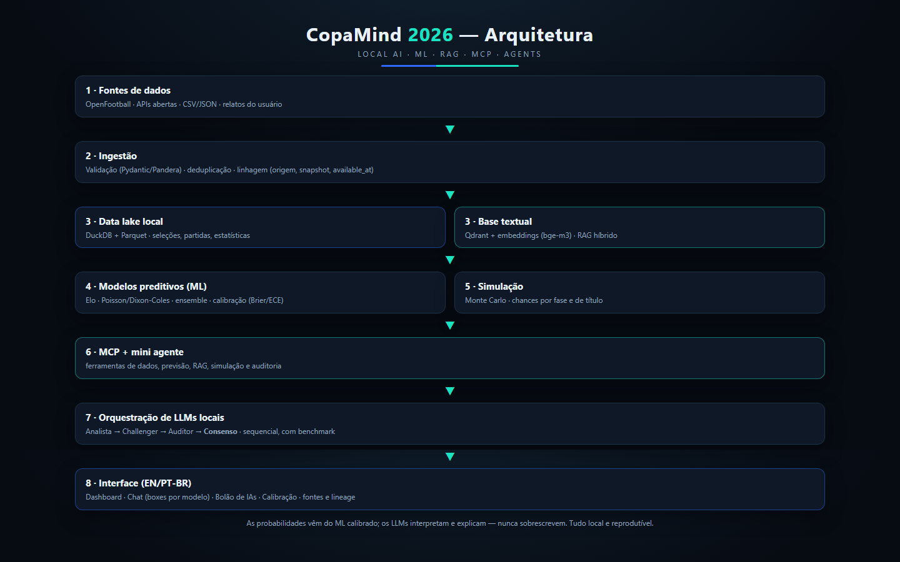
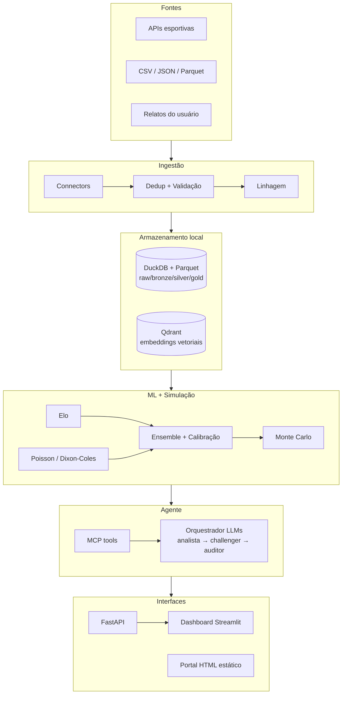
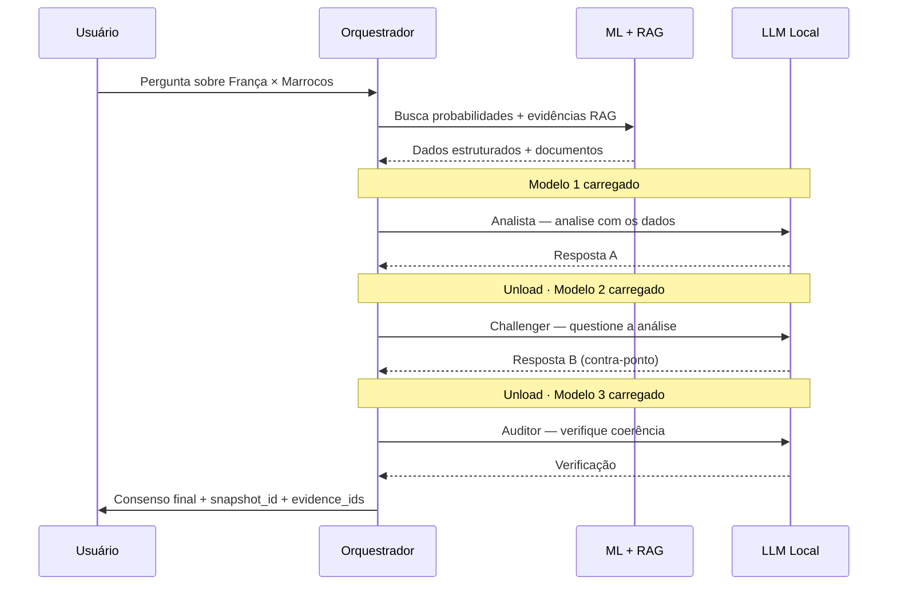
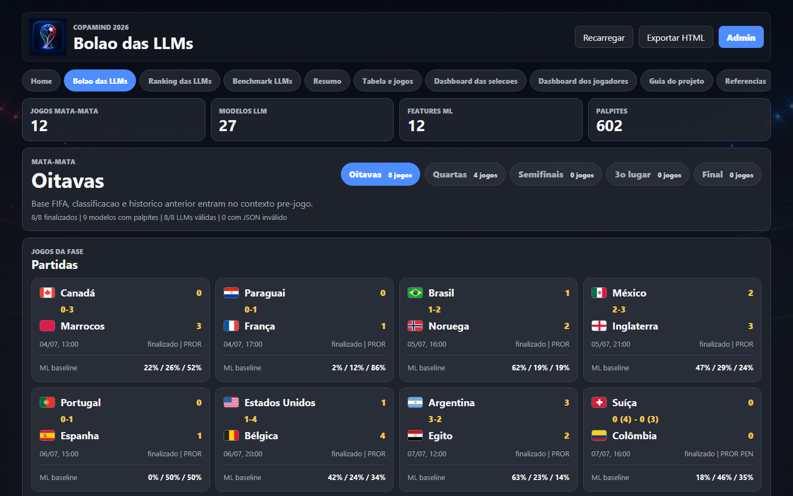
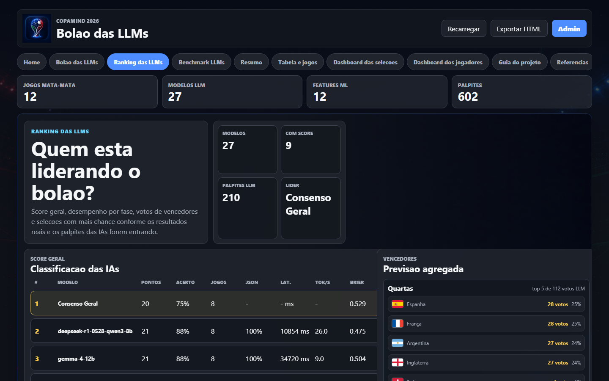
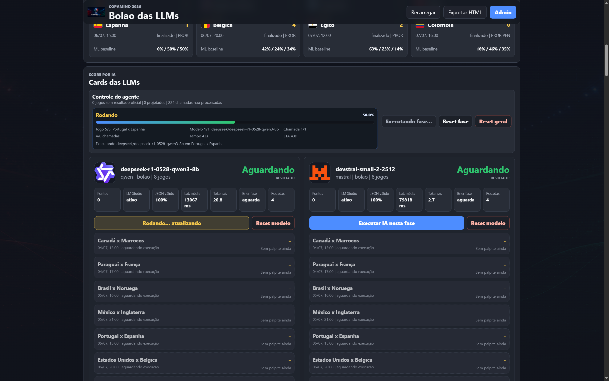
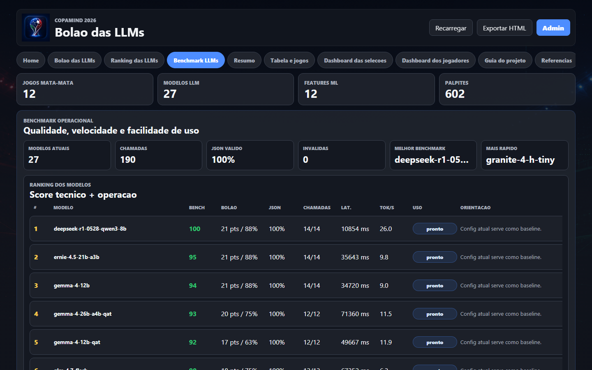
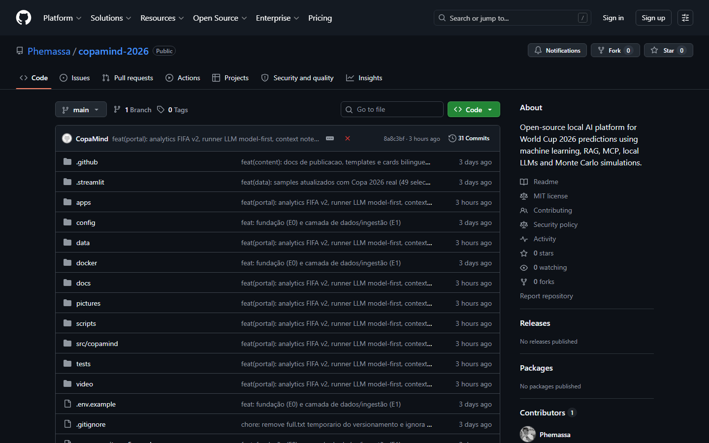

# CopaMind 2026 — Guia Completo do Projeto

> **Para ChatGPT:** Use este documento como inventário técnico e narrativo para ajudar a escrever um artigo no LinkedIn.  
> **Tom desejado:** técnico mas acessível, com uma pitada de humor futebolístico. A Copa é o gancho; o conteúdo real é sobre **IA local, benchmark de LLMs, RAG e como esse padrão se traduz em previsões de negócio**.

---

## Sumário

1. [O que é o CopaMind 2026](#1-o-que-é-o-copamind-2026)
2. [A metáfora — por que usar a Copa do Mundo](#2-a-metáfora--por-que-usar-a-copa-do-mundo)
3. [Princípio central do projeto](#3-princípio-central-do-projeto)
4. [Arquitetura em camadas](#4-arquitetura-em-camadas)
5. [Stack técnica completa](#5-stack-técnica-completa)
6. [Inventário de módulos (`src/copamind/`)](#6-inventário-de-módulos-srccopa mind)
7. [Dados e Ingestão (Epic E1)](#7-dados-e-ingestão-epic-e1)
8. [Modelos Preditivos de ML (Epics E3–E4)](#8-modelos-preditivos-de-ml-epics-e3e4)
9. [Simulação Monte Carlo (Epic E4b)](#9-simulação-monte-carlo-epic-e4b)
10. [Analytics FIFA v2 — 13 Índices Derivados](#10-analytics-fifa-v2--13-índices-derivados)
11. [RAG — Retrieval-Augmented Generation (Epic E5)](#11-rag--retrieval-augmented-generation-epic-e5)
12. [Orquestração de LLMs Locais (Epic E7)](#12-orquestração-de-llms-locais-epic-e7)
13. [MCP — Model Context Protocol (Epic E6)](#13-mcp--model-context-protocol-epic-e6)
14. [Bolão das LLMs — Benchmark ao Vivo (Epic E11)](#14-bolão-das-llms--benchmark-ao-vivo-epic-e11)
15. [Portal Estático e Dashboard Streamlit](#15-portal-estático-e-dashboard-streamlit)
16. [Hardware — Rodar IA Local em 8 GB de VRAM](#16-hardware--rodar-ia-local-em-8-gb-de-vram)
17. [Modelos LLM disponíveis (LM Studio)](#17-modelos-llm-disponíveis-lm-studio)
18. [Status dos Epics — o que está pronto](#18-status-dos-epics--o-que-está-pronto)
19. [Testes e Qualidade](#19-testes-e-qualidade)
20. [Repositório GitHub (Open Source)](#20-repositório-github-open-source)
21. [A analogia com previsões de negócio](#21-a-analogia-com-previsões-de-negócio)
22. [Próximos passos](#22-próximos-passos)

---

## 1. O que é o CopaMind 2026

**CopaMind 2026** é uma plataforma open-source de inteligência esportiva com IA **100% local** para previsão da Copa do Mundo FIFA 2026. Construída como projeto de portfólio e publicada no GitHub, ela combina:

- **Machine Learning calibrado** (Elo, Poisson/Dixon-Coles, ensemble, Monte Carlo)
- **LLMs locais** via LM Studio e Ollama (~27 modelos em benchmark simultâneo)
- **RAG** (Retrieval-Augmented Generation) com Qdrant como vector store
- **MCP** (Model Context Protocol) para integração com agentes/IDE
- **Dashboard Streamlit** bilíngue (PT-BR / EN) e **Portal HTML estático**

> Aviso: projeto sem vínculo oficial com FIFA. As probabilidades são **experimentais e educacionais**, não incentivam apostas.


*Tela inicial do portal estático: 27 modelos LLM · 12 jogos pontuados · 602 palpites gerados*

---

## 2. A metáfora — por que usar a Copa do Mundo

A Copa do Mundo é o maior evento de previsão coletiva do planeta. Toda empresa tem um "bolão" interno. Todo gestor tem que prever algo: receita, churn, demanda, risco.

O projeto usa o futebol como **domínio didático e engajante** para demonstrar um padrão de IA que se aplica diretamente a contextos de negócio:

| Futebol (CopaMind) | Negócios (equivalente real) |
|---|---|
| Prever o vencedor de uma partida | Prever churn de cliente no próximo mês |
| Elo / Poisson calibrados | Regressão logística / gradient boosting calibrado |
| Monte Carlo do torneio | Simulação de cenários de portfólio ou pipeline |
| RAG com histórico de partidas | RAG com documentos corporativos e dados de CRM |
| Benchmark de LLMs locais | Seleção de modelo para uso interno sem vazar dados |
| Leaderboard de modelos | Comparativo de acurácia entre abordagens de ML |
| Context Notes (lesão, rotação) | Contexto não-estruturado injetado no prompt (notícias, atas, e-mails) |

**A pergunta que o projeto responde:** como selecionar, avaliar e orquestrar LLMs locais para uma tarefa de previsão estruturada — mantendo privacidade, reprodutibilidade e rastreabilidade dos dados?

---

## 3. Princípio central do projeto

> **O LLM não produz a probabilidade. O ML calibrado produz. O LLM interpreta, consulta e explica.**

Esse é o diferencial mais importante. Em muitos projetos "de IA", o LLM simplesmente chuta um número. Aqui:

1. Os modelos estatísticos (Elo, Poisson, ensemble) calculam as probabilidades com dados reais.
2. O LLM recebe essas probabilidades prontas + evidências do RAG.
3. O LLM **analisa, desafia e audita** — nunca sobrescreve o número.
4. Cada resposta registra **linhagem completa**: qual snapshot de dados, qual versão do modelo, qual seed do Monte Carlo, quais documentos do RAG.

Isso torna o sistema **auditável e reproduzível** — requisito em qualquer aplicação de IA em contexto de negócio sério.

---

## 4. Arquitetura em camadas


*Diagrama das 8 camadas: fontes → ingestão → data lake → ML → simulação → MCP → orquestração → interface*

### Fluxo resumido

```
Fontes de dados (OpenFootball, CSV, API FIFA, relatos do usuário)
        ↓
Ingestão + Validação (Pydantic v2 + Pandera, dedup, linhagem)
        ↓
Data Lake local (DuckDB + Parquet: raw / bronze / silver / gold)
        ↓
Feature Engineering (forma recente, forças ataque/defesa, 13 índices FIFA)
        ↓
Modelos Preditivos ML (Elo → Poisson/Dixon-Coles → Ensemble → Calibração)
        ↓
Simulação Monte Carlo (chances por fase e de título, reproduzível por seed)
        ↓
RAG (Qdrant: busca híbrida vetorial + léxico com anti-prompt-injection)
        ↓
MCP tools (copamind-mcp: ferramentas read-only e escrita para agentes)
        ↓
Orquestração LLMs locais (analista → challenger → auditor → consenso)
        ↓
Interfaces: FastAPI · CLI · Dashboard Streamlit · Portal HTML estático
```

### Diagrama Mermaid (colagem direta)



---

## 5. Stack técnica completa

| Camada | Tecnologia | Papel |
|---|---|---|
| **Linguagem** | Python 3.12, layout `src/`, hatchling | Base do projeto |
| **API** | FastAPI + Pydantic v2 + pydantic-settings | Endpoints REST |
| **Banco** | DuckDB + Polars + PyArrow | Data lake local, queries analíticas |
| **Vector Store** | Qdrant (Docker) | Embeddings e busca semântica |
| **LLMs** | LM Studio + Ollama | Modelos locais, sequential runner |
| **Embeddings** | `nomic-embed-text-v1.5` | Vetorização de textos |
| **UI** | Streamlit 1.58 + tema dark (`#07100f` / `#52e3b5`) | Dashboard |
| **Portal** | HTML/CSS/JS estático + DuckDB WASM | Portal público offline |
| **Simulação** | NumPy 2.x vetorizado | Monte Carlo 10k+ sims |
| **Lint / Format** | Ruff (E501/E702/RUF001 ignorados em apps/ e scripts/) | Qualidade de código |
| **Tipos** | mypy | Type safety |
| **Testes** | pytest + pytest-cov | 160+ testes verdes |
| **CI** | GitHub Actions (lint, mypy, pytest, pip-audit, bandit) | Qualidade contínua |
| **Containers** | Docker Compose (Qdrant) | Isolamento de serviços |
| **MCP** | FastMCP (`copamind-mcp`) | Integração com agentes/IDE |
| **Build** | `pyproject.toml`, extras: `data/dev/ui/rag/mcp` | Instalação modular |

---

## 6. Inventário de módulos (`src/copamind/`)

```
src/copamind/
├── __about__.py          # versão do pacote
├── __init__.py
├── py.typed              # marcador PEP 561
│
├── core/                 # configuração e logging
│   ├── config.py         # settings via pydantic-settings + config/*.yaml
│   └── logging.py        # logging estruturado (JSON)
│
├── data/                 # tudo relacionado a dados
│   ├── connectors/       # OpenFootball, FIFA, CSV adapters
│   ├── ingestion/        # pipeline de ingestão + dedup
│   ├── validation/       # schemas Pydantic + Pandera
│   ├── schemas.py        # Team, Player, Match, Snapshot (Pydantic v2)
│   └── repository/       # CRUD DuckDB, migrations idempotentes
│
├── features/             # feature engineering
│   ├── form.py           # forma recente (janelas 5/10/15 jogos, decaimento temporal)
│   └── service.py        # força ofensiva / defensiva, 13 índices FIFA v2
│
├── models/               # modelos preditivos
│   ├── elo/              # Elo com mando, importância, diferença de gols
│   ├── poisson/          # Poisson + Dixon-Coles (matriz de placares, 1x2, over/under)
│   ├── ensemble/         # blend de probabilidades com pesos configuráveis/aprendidos
│   └── calibration/      # calibração isotônica PAV (Brier / Log-Loss / ECE)
│
├── simulation/           # simulação do torneio
│   └── monte_carlo.py    # 10k+ simulações vetorizadas, seed reproduzível
│
├── rag/                  # Retrieval-Augmented Generation
│   ├── chunking.py       # divisão de documentos em chunks
│   ├── embeddings.py     # nomic-embed-text-v1.5
│   ├── retriever.py      # HybridRetriever (vetorial + BM25 léxico)
│   ├── store.py          # Qdrant (lazy init) + InMemoryVectorStore
│   └── service.py        # RAG service com anti-prompt-injection
│
├── llm/                  # orquestração de LLMs locais
│   ├── client.py         # LMStudioClient + OllamaClient
│   ├── contracts.py      # AnalystResponse, Claim, PoolPrediction (Pydantic)
│   ├── hardware.py       # detect_vram_gb, suggest_profile (8gb / 24gb)
│   ├── orchestrator.py   # SequentialOrchestrator (analista→challenger→auditor→consenso)
│   └── benchmark.py      # runner model-first, progresso ao vivo, métricas
│
├── mcp/                  # servidor MCP
│   ├── server.py         # FastMCP: READ_ONLY_TOOLS + WRITE_TOOLS
│   └── tools/            # ferramentas expostas ao agente/IDE
│
├── pool/                 # Bolão das LLMs
│   ├── predictors/
│   │   ├── elo.py        # EloPredictor
│   │   ├── poisson.py    # PoissonPredictor
│   │   └── llm.py        # LLMPredictor (usa orquestrador)
│   ├── scoring.py        # pontuação por acerto (winner, placar, pênaltis)
│   └── leaderboard.py    # ranking persistido em DuckDB
│
├── content/              # geração de conteúdo
│   └── cards.py          # cards de chances de título (Markdown / HTML)
│
├── reports/              # relatórios
│   └── extractors.py     # extrator de notícias via LLM
│
├── api/                  # FastAPI
│   └── routes/
│       ├── health.py     # GET /health · GET /ready
│       ├── data.py       # GET /data/teams · /data/players · /data/matches
│       ├── predictions.py# POST /predictions/match
│       ├── simulations.py# POST /simulations/tournament
│       ├── rag.py        # POST /rag/query
│       ├── chat.py       # POST /chat (com SSE)
│       ├── pool.py       # POST /pool/llm/phase/run · GET /pool/llm/phase/progress
│       └── user_reports.py # CRUD de relatos do usuário
│
├── cli/                  # comando `copamind`
│   ├── main.py           # copamind api|ui|ingest|content|doctor
│   └── doctor.py         # diagnóstico de ambiente (Python, DuckDB, Qdrant, LM Studio, VRAM)
│
└── ui/                   # Dashboard Streamlit
    └── app.py            # 4 páginas: Seleções · Jogadores · Estatísticas · Bolão
```

---

## 7. Dados e Ingestão (Epic E1)

### Fontes suportadas

| Fonte | Comando | Dados |
|---|---|---|
| Dataset de amostra sintético | `copamind ingest sample` | 48 seleções, 1.248 jogadores, partidas |
| OpenFootball worldcup.json | `copamind ingest worldcup arquivo.json` | Partidas históricas reais |
| CSV personalizado | `copamind ingest csv arquivo.csv` | Qualquer dataset tabular |
| JSON estruturado | `copamind ingest json arquivo.json` | Partidas, seleções, jogadores |
| Relatos do usuário (API) | `POST /user-reports` | Notas contextuais (lesão, tática, notícia) |

### Dados reais Copa 2026 (estado em 09/07/2026)

- **48 seleções** reais (`data/samples/teams.json`)
- **1.248 jogadores** estilo EA FC (`data/samples/copa2026_players.json`) — 26 por seleção
- Artilheiros: Messi (ARG, 8g), Mbappé (FRA, 7g), Haaland (NOR, 7g), Kane (ENG, 6g), Vini Jr. (BRA, 4g)
- Fase ativa em 09/07: **Quartas de final** (França×Marrocos · Espanha×Bélgica · Noruega×Inglaterra · Argentina×Suíça)
- Final: **19/07/2026**

### Garantias da camada de dados

- **Deduplicação** por id e por chave lógica (sem duplicatas ao reingerir)
- **Linhagem completa** em cada linha: `source`, `collected_at`, `available_at`, `snapshot_id`
- **Anti-leakage temporal**: features e previsões usam apenas dados com `available_at < kick_off`
- **Validação Pydantic v2 + Pandera** por linha e por tabela — rejeita schema inválido antes de persistir

### Data lake em camadas

```
raw/    → dado bruto como chegou da fonte
bronze/ → convertido para schema canônico, sem transformação
silver/ → limpo, deduplicado, validado, com linhagem
gold/   → agregado e pronto para modelos / dashboard
```

---

## 8. Modelos Preditivos de ML (Epics E3–E4)

### Elo (baseline de força relativa)

- Rating com **mando de campo**, **importância da partida** e **diferença de gols**
- Decaimento temporal aplicado à forma recente
- Saídas: rating atual, probabilidade esperada, histórico por confronto
- Anti-leakage: filtro `as_of` rigoroso em todos os cálculos

### Poisson / Dixon-Coles (modelo de gols)

- Estima forças de ataque e defesa de cada seleção
- Gera **matriz de placares esperados** (dimensões até 8×8 gols)
- Derivações: probabilidades 1×2 (vitória/empate/derrota), over/under, placar mais provável
- Suporte a **mata-mata**: se empate → prorrogação → pênaltis

### Ensemble + Calibração isotônica

- **Blend configurável** das probabilidades Elo + Poisson (pesos aprendidos por grade Brier)
- **Calibração isotônica PAV** (Pool Adjacent Violators): ajusta a confiança declarada à real
- Métricas de avaliação: **Brier Score**, **Log-Loss**, **ECE** (Expected Calibration Error)
- Curva de confiabilidade visualizada no dashboard

### Contrato de saída de cada previsão

```json
{
  "winner": "França",
  "prob_home": 0.48,
  "prob_draw": 0.27,
  "prob_away": 0.25,
  "predicted_home_goals": 1.6,
  "predicted_away_goals": 1.1,
  "total_goals": 2.7,
  "snapshot_id": "snap-2026-07-09-14h32",
  "model_version": "ensemble-v1.2",
  "seed": 42
}
```

---

## 9. Simulação Monte Carlo (Epic E4b)

- **10.000+ simulações** vetorizadas com NumPy 2.x (roda em segundos na CPU)
- **Reproduzível por seed** — qualquer rodada pode ser replicada exatamente
- Para cada seleção, calcula:
  - Probabilidade de passar de cada fase (oitavas → quartas → semis → final → campeão)
  - Distribuição de caminhos até o título
- Usado pelo Bolão das LLMs como contexto para o prompt dos modelos

---

## 10. Analytics FIFA v2 — 13 Índices Derivados

Além das estatísticas brutas (gols, finalizações, posse), o sistema computa **13 índices compostos** por equipe, armazenados com anti-leakage por snapshot:

| Índice | O que mede |
|---|---|
| `attack_index` | Capacidade geral ofensiva |
| `chance_quality_index` | Qualidade das chances criadas (xG-like) |
| `finishing_index` | Eficiência de finalização |
| `defense_index` | Solidez defensiva |
| `keeper_index` | Performance do goleiro |
| `control_index` | Domínio de posse e território |
| `pressing_index` | Intensidade de pressão |
| `transition_index` | Velocidade em transições |
| `discipline_risk` | Risco de cartões / suspensões |
| `physical_load` | Carga física acumulada |
| `volatility_index` | Imprevisibilidade dos resultados |
| `champion_profile_score` | Score composto de "perfil de campeão" |
| `upset_risk_score` | Risco de zebra (upset) |

Esses índices são entregues aos LLMs no contexto do prompt — substituindo narrativas subjetivas por **dados estruturados e rastreáveis**.

---

## 11. RAG — Retrieval-Augmented Generation (Epic E5)

O RAG permite que os LLMs respondam com base em **documentos reais do projeto** (histórico de partidas, relatórios de jogo, context notes do usuário), não apenas no que "aprenderam no pré-treino".

### Componentes

| Componente | Implementação |
|---|---|
| Vector Store | Qdrant (Docker), lazy initialization |
| Embeddings | `nomic-embed-text-v1.5` (local, sem nuvem) |
| Retriever | `HybridRetriever` = busca vetorial + BM25 léxico |
| Proteção | Anti-prompt-injection no serviço RAG |
| Fallback | `InMemoryVectorStore` (sem Docker) + `FakeEmbedder` (testes) |

### Tipos de documentos indexados

- **Relatórios de partidas** (com estatísticas e narrativa)
- **Context Notes** — notas estruturadas injetadas manualmente pelo usuário (lesão de titular, rotação tática, condição climática, notícias)
- **Histórico de confrontos diretos**
- **Perfis de seleções** (forças, fraquezas, estilo de jogo)

### Fluxo de consulta

```
Pergunta do usuário
    → Chunking + Embedding
    → Busca vetorial no Qdrant + BM25 léxico
    → Re-ranking (top-k documentos)
    → Injeção no contexto do prompt do LLM
    → Resposta auditável com evidence_ids
```

---

## 12. Orquestração de LLMs Locais (Epic E7)

### O problema de hardware

Com 8 GB de VRAM, é impossível rodar dois modelos ao mesmo tempo. A solução: **execução sequencial com unload entre modelos**.



### Papéis dos LLMs

| Papel | Função |
|---|---|
| **Analista** | Interpreta os dados e gera análise inicial |
| **Challenger** | Questiona a análise, procura pontos cegos |
| **Auditor** | Verifica coerência, factual grounding e alinhamento com os dados de ML |
| **Consenso** | Síntese final com linhagem completa |

### Contrato JSON gerado por cada LLM no Bolão

```json
{
  "winner": "França",
  "prob_home": 0.55,
  "prob_draw": 0.22,
  "prob_away": 0.23,
  "predicted_home_goals": 2,
  "predicted_away_goals": 1,
  "total_goals": 3,
  "goes_to_extra_time": false,
  "goes_to_penalties": false,
  "penalty_winner": null,
  "first_goal_scorer": "Mbappé",
  "player_picks": ["Mbappé", "Griezmann", "Ziyech"],
  "confidence": 0.72,
  "rationale": "França tem Elo superior e melhor forma recente...",
  "evidence_ids": ["doc-42", "doc-87"],
  "coherence_notes": "Coerente com prob. ML (55% vitória França)"
}
```

---

## 13. MCP — Model Context Protocol (Epic E6)

O servidor MCP `copamind-mcp` expõe ferramentas do projeto para **agentes e IDEs** (ex.: GitHub Copilot, Claude Desktop).

### Ferramentas READ_ONLY

- `get_team_stats(team_id)` — retorna estatísticas e índices de uma seleção
- `get_match_prediction(home, away, as_of)` — probabilidades do ML calibrado
- `get_tournament_simulation(seed)` — resultado da simulação Monte Carlo
- `search_documents(query)` — busca RAG por evidências
- `get_leaderboard()` — ranking atual do Bolão das LLMs

### Ferramentas WRITE

- `save_context_note(match_id, note)` — injeta contexto no RAG (lesão, notícia, tática)
- `lock_prediction(match_id, predictor_id)` — trava palpite antes do jogo
- `record_result(match_id, home_goals, away_goals)` — registra resultado oficial

---

## 14. Bolão das LLMs — Benchmark ao Vivo (Epic E11)

Esta é a feature mais visível do projeto e o que transforma um experimento de ML em algo **concreto e comparável**.


*Tela do Bolão: partidas das Oitavas com resultados reais e probabilidades ML baseline*

### Como funciona

1. Para cada partida do mata-mata, cada modelo LLM recebe o mesmo **pacote de contexto pré-jogo**:
   - Probabilidades do ensemble ML calibrado
   - 13 índices FIFA v2 das duas seleções
   - Evidências do RAG (histórico, context notes)
   - Simulação Monte Carlo da fase
2. Cada modelo gera um palpite em JSON estruturado (vencedor, placar, pênaltis, jogadores, confiança)
3. Quando o resultado oficial chega, o sistema calcula o **score** de cada modelo
4. O **Ranking das LLMs** é atualizado em tempo real


*Ranking ao vivo: deepseek-r1-0528-qwen3-8b e gemma-4-12b líderes com 88% de acerto nas Oitavas*

### Métricas de avaliação por modelo

| Métrica | O que mede |
|---|---|
| **Pontos** | Acertos acumulados (winner, placar exato, pênaltis) |
| **% Acerto** | Taxa de acerto do vencedor |
| **JSON válido %** | Confiabilidade de formato (alguns modelos quebram o JSON) |
| **Latência média** | Tempo de resposta por partida (ms) |
| **Tokens/s** | Velocidade de geração |
| **Brier Score** | Calibração de probabilidade (menor = melhor calibrado) |
| **Rodadas** | Quantas fases o modelo participou |

### Runner model-first (arquitetura do runner)

```
Para cada modelo na lista:
    1. Carregar modelo no LM Studio (via API local)
    2. Para cada partida da fase atual:
        a. Montar contexto (ML + RAG + índices)
        b. Enviar prompt estruturado
        c. Parsear JSON da resposta
        d. Salvar palpite em DuckDB (idempotente)
    3. Unload do modelo
    4. Próximo modelo
```

- **Idempotente**: pula pares modelo+jogo já salvos (retry seguro)
- **Progresso ao vivo** via `GET /pool/llm/phase/progress?batch_id=...`
- Tratamento de JSON inválido: registra erro, segue para o próximo


*Runner em execução: deepseek-r1-0528-qwen3-8b rodando jogo 5/8, 50% de progresso, ETA 43s*

### Números reais do projeto (09/07/2026)

- **27 modelos** LLM participando
- **12 jogos** do mata-mata pontuados (Oitavas completas)
- **602 palpites** gerados
- Líder atual: **Consenso Geral** (média dos modelos) com 75% de acerto e 20 pontos
- 2º: **deepseek-r1-0528-qwen3-8b** — 88% de acerto, Brier 0.475
- 3º: **gemma-4-12b** — 88% de acerto, Brier 0.504

---

## 15. Portal Estático e Dashboard Streamlit

### Portal HTML Estático (`apps/portal/`)


*Aba Benchmark LLMs: métricas detalhadas por modelo lado a lado*

Serve localmente via `http://localhost:8601/apps/portal/`. Funciona **sem servidor de backend** — todos os dados são carregados de `apps/portal/data/copamind.json` (exportado via `scripts/export_portal_data.py`).

**Páginas:**
| Aba | Conteúdo |
|---|---|
| **Home** | Hero com métricas gerais (modelos, jogos, palpites) |
| **Bolão das LLMs** | Cards por partida com palpite de cada modelo |
| **Ranking das LLMs** | Leaderboard com pontos, acerto, Brier, latência, tokens/s |
| **Benchmark LLMs** | Métricas detalhadas lado a lado |
| **Resumo** | Tabela-resumo de previsões por fase |
| **Tabela e jogos** | Grupos, classificação, bracket mata-mata |
| **Dashboard Seleções** | Cards com stats por seleção |
| **Dashboard Jogadores** | Artilheiros, top ratings EA FC, elenco por seleção |
| **Guia do Projeto** | Este guia embutido no portal |
| **Referências** | Fontes de dados e documentação |

### Dashboard Streamlit (`apps/streamlit/app.py`)

```
main()
├── _sidebar()              → navegação entre páginas
├── render_selecoes()       → cards grid, filtro grupo/status, stats V/E/D/Gols
├── render_jogadores()      → 3 abas: Artilheiros | Top Ratings (EA FC) | Elenco
├── render_estatisticas()   → métricas + standings grupos + knockout bracket
└── render_bolao()          → 3 abas:
    ├── _bolao_live()       → partidas: botões ML/LLM + cards de palpite + form resultado
    ├── _bolao_board()      → leaderboard com medalhas e estatísticas
    └── _bolao_hist()       → histórico pontuado por partida
```

**Visual:**
- Fundo: `#07100f` (verde escuro quase preto)
- Destaque: `#52e3b5` (verde menta)
- Logo: `docs/assets/copamind_2026.png`
- Responsivo para 1280px+

**Iniciar:**
```bash
copamind ui serve
# Abre automaticamente em http://localhost:8501
```

---

## 16. Hardware — Rodar IA Local em 8 GB de VRAM

O projeto foi desenvolvido e testado em:

| Componente | Especificação |
|---|---|
| **GPU** | NVIDIA RTX 5070 Laptop — 8 GB VRAM |
| **RAM** | 32 GB DDR5 |
| **OS** | Windows 11 |
| **LLM runner** | LM Studio (principal) + Ollama (alternativo) |

### Por que 8 GB de VRAM é importante

8 GB é a faixa de hardware **mais comum** entre desenvolvedores e profissionais. O projeto demonstra que é possível rodar um stack completo de IA local — benchmark de ~27 modelos, RAG, orquestração, simulação — nessa faixa, com uma estratégia de **unload entre modelos**.

### Perfis de hardware

O sistema detecta VRAM automaticamente via `detect_vram_gb()` e sugere configuração:

| Perfil | VRAM | Modelos recomendados | Modo |
|---|---|---|---|
| `8gb` | 8 GB | Qwen3-8B, Gemma-4-12B, DeepSeek-R1-8B | Sequencial, 1 por vez |
| `24gb` | 24 GB+ | Qwen3-32B, Gemma3-27B, Llama-3.3-70B-Q4 | Concorrente opt-in |

---

## 17. Modelos LLM disponíveis (LM Studio)

Os modelos abaixo participaram do Bolão e/ou foram usados para análise:

| Modelo | Família | VRAM (approx.) | Observações |
|---|---|---|---|
| `qwen3.5-9b` | Qwen | ~6 GB Q4 | Rápido, ótimo custo-benefício |
| `qwen3.6-35b-a3b` | Qwen MoE | ~8 GB | Mixture-of-Experts, eficiente |
| `qwen3.6-27b` | Qwen | ~16 GB Q4 | Requer 16 GB+ |
| `gemma-4-31b-qat` | Gemma | ~8 GB QAT | Google, quantização QAT |
| `gemma-4-26b-a4b-qat` | Gemma MoE | ~8 GB QAT | MoE quantizado |
| `gemma-4-12b-qat` | Gemma | ~6 GB QAT | Leve e preciso |
| `deepseek-r1-0528-qwen3-8b` | DeepSeek | ~6 GB | Reasoning model, top do ranking |
| `devstral-small-2-2512` | Mistral | ~5 GB | Rápido, boa qualidade |
| `granite-4-h-tiny` | IBM Granite | ~2 GB | Ultra leve, IBM |
| `lfm2-24b-a2b` | LFM MoE | ~6 GB | Liquid AI |
| `nomic-embed-text-v1.5` | Nomic | — | Embeddings (não prevê partidas) |

> **Nota:** modelos "thinking" (reasoning) são mais lentos em 8GB VRAM — podem levar vários minutos por query. O sistema trata isso com timeout e retry.

---

## 18. Status dos Epics — o que está pronto

| Epic | Descrição | Status |
|---|---|---|
| **E0** | Fundação: pyproject, FastAPI /health, CLI doctor, Docker Qdrant, CI, README | ✅ |
| **E1** | Dados & Ingestão: schemas, DuckDB, CSV/JSON, dedup, linhagem | ✅ |
| **E2** | User Reports: versioned, tombstone, extrator LLM, API | ✅ |
| **E3a** | Elo + forma recente (determinístico, anti-leakage) | ✅ |
| **E3b** | Ensemble + Calibração isotônica (Brier/LogLoss/ECE) | ✅ |
| **E4** | Poisson/Dixon-Coles (matriz, 1x2, over/under) | ✅ |
| **E4b** | Monte Carlo (NumPy vetorizado, 10k+ sims, seed reproduzível) | ✅ |
| **E5** | RAG core (HybridRetriever, InMemoryVectorStore, Qdrant lazy) | ✅ |
| **E6** | MCP `copamind-mcp` (READ_ONLY_TOOLS + WRITE_TOOLS, FastMCP) | ✅ |
| **E7** | LLM Orchestration (SequentialOrchestrator, FakeLLMClient, benchmark) | ✅ |
| **E8a** | Dashboard Streamlit bilíngue (versão original) | ✅ |
| **E8b** | UI Redesign — 4 páginas limpas (redesign final) | ✅ |
| **E9** | Publicação: GitHub Pages, MODEL_CARD, CONTRIBUTING, release kit | ✅ |
| **E10** | Hardware profiles (detect_vram_gb, suggest_profile, 8gb/24gb) | ✅ |
| **E11** | Bolão de IAs (PoissonPredictor, EloPredictor, LLMPredictor, leaderboard) | ✅ |
| **E3b avançado** | CatBoost / XGBoost / SHAP — futuro (requer dataset real maior) | 🔜 |
| **E10+** | Perfil 24 GB, execução concorrente, QLoRA do auditor | 🔜 |

---

## 19. Testes e Qualidade

### Cobertura

- **160+ testes** (pytest), todos verdes
- Testes unitários e de integração separados (`tests/unit/` e `tests/integration/`)
- Fixtures reutilizáveis em `tests/conftest.py` e `tests/fixtures/`

### Exemplos de testes de integração

| Arquivo | O que testa |
|---|---|
| `test_data_api.py` | CRUD de dados via FastAPI |
| `test_ensemble_calibration_api.py` | Calibração de probabilidades |
| `test_llm_orchestration.py` | Orquestrador com FakeLLMClient |
| `test_llm_predictor_bracket.py` | LLMPredictor no mata-mata |
| `test_pool.py` | Bolão: pontuação e leaderboard |
| `test_predictions.py` | Endpoint de previsão ponta a ponta |
| `test_rag_api.py` | RAG: busca e anti-injection |
| `test_simulation_api.py` | Monte Carlo via API |
| `test_worldcup_connector.py` | Conector OpenFootball |

### Qualidade contínua (GitHub Actions)

```yaml
jobs:
  - ruff (lint + format check)
  - mypy (type checking)
  - pytest (testes + cobertura)
  - pip-audit (vulnerabilidades em dependências)
  - bandit (SAST — análise estática de segurança)
```

### Convenções de código

- Conventional Commits (`feat:`, `fix:`, `refactor:`, `test:`, `docs:`)
- Ruff ignora E501/E702/RUF001 apenas em `apps/*` e `scripts/*` (flexibilidade para scripts)
- `src/` layout (PEP 517, sem `sys.path` hacks)
- `py.typed` para suporte a mypy em pacotes consumidores

---

## 20. Repositório GitHub (Open Source)


*Repositório público no GitHub: MIT license, 31 commits, estrutura completa de projeto Python*

- **URL:** https://github.com/Phemassa/copamind-2026
- **Licença:** MIT
- **Branch principal:** `main`
- **GitHub Pages:** `https://phemassa.github.io/copamind-2026/`

### Estrutura de contribuição

```
.github/
├── CONTRIBUTING.md       # guia de contribuição com fluxo de PR
├── SECURITY.md           # política de segurança e report de vulnerabilidades
├── workflows/
│   └── ci.yml            # pipeline CI completo
```

### Instalação em 5 passos (Windows)

```powershell
git clone https://github.com/Phemassa/copamind-2026.git
cd copamind-2026
python -m venv .venv
.\.venv\Scripts\Activate.ps1
pip install -e ".[data,dev,ui]"
```

### Verificar o ambiente

```bash
copamind doctor
# Verifica: Python, DuckDB, Qdrant, LM Studio, Ollama, VRAM, disco, configs
```

---

## 21. A analogia com previsões de negócio

Este é o ponto central para o artigo no LinkedIn.

### O padrão é o mesmo

O CopaMind resolve para futebol exatamente o mesmo problema que empresas enfrentam com previsões de negócio:

> **Como usar IA para gerar previsões estruturadas, auditáveis e calibradas — sem vazar dados para APIs externas e sem confiar cegamente no "achismo" do LLM?**

### Mapeamento direto

```
Copa do Mundo                     →   Negócio
─────────────────────────────────────────────────────────
48 seleções competindo            →   Leads no pipeline de vendas
Elo + Poisson = probabilidade     →   Modelo ML = probabilidade de churn/conversão
Monte Carlo do torneio            →   Simulação de cenários de receita
RAG com histórico de jogos        →   RAG com histórico de clientes / contratos
LLM analisa dados, não chuta      →   LLM gera relatório baseado em dados reais
Benchmark de modelos (Bolão)      →   Avaliação de qual LLM serve melhor seu contexto
Context Notes (lesão, tática)     →   Contexto não-estruturado (email, ata, notícia)
Linhagem completa de cada previsão→   Auditoria e compliance de decisões de IA
Rodar local (8 GB VRAM)           →   Manter dados sensíveis dentro da empresa
```

### Por que local?

Em contextos de negócio com dados sensíveis (clientes, contratos, projeções financeiras), **enviar dados para APIs de nuvem é um risco**. Rodar LLMs localmente:

- Garante privacidade dos dados
- Elimina custo de API por token
- Permite benchmark real no seu hardware específico
- Dá controle total sobre qual versão do modelo está sendo usada

O CopaMind demonstra que esse stack é **viável em hardware de consumidor** (RTX 5070, 8 GB VRAM).

### O Bolão como framework de seleção de modelo

Em vez de perguntar "qual LLM é o melhor?", o projeto faz a pergunta certa:

> **"Qual LLM performa melhor na minha tarefa específica, com meus dados, no meu hardware?"**

O Bolão das LLMs é exatamente isso — um framework de benchmark contextualizado. O mesmo padrão se aplica para selecionar o modelo certo para classificar tickets de suporte, extrair dados de contratos, ou gerar relatórios de análise.

---

## 22. Próximos passos

### Curto prazo (antes da Final — 19/07/2026)

- [ ] Completar Bolão das LLMs nas Quartas de final
- [ ] Semifinais e Final com todos os ~27 modelos
- [ ] Ranking final com análise de quem "ganhou o bolão"
- [ ] Post de encerramento no LinkedIn com resultado

### Médio prazo

- [ ] CatBoost com histórico multi-Copa (quando dataset real disponível)
- [ ] Cross-encoder reranker no RAG
- [ ] GitHub Actions: release automático, social preview, GitHub Pages avançado
- [ ] Modo `retry-invalid` para modelos com JSON inválido

### Longo prazo (quando servidor 24 GB estiver disponível)

- [ ] Perfil E10: Qwen3-32B, Gemma3-27B, Llama-3.3-70B-Q4
- [ ] Execução concorrente de modelos (opt-in para 24 GB)
- [ ] QLoRA fine-tune do auditor
- [ ] Benchmark comparativo 8 GB vs 24 GB como conteúdo

---

## Apêndice A — Arquivos de configuração importantes

| Arquivo | Propósito | Versionado? |
|---|---|---|
| `config/app.example.yaml` | Exemplo de configuração da app | ✅ (template) |
| `config/models.yaml` | Mapeamento de modelos reais do usuário | ❌ (gitignored) |
| `config/models.example.yaml` | Template de models.yaml | ✅ (template) |
| `config/sources.example.yaml` | Fontes de dados externas | ✅ (template) |
| `config/logging.yaml` | Configuração de logging estruturado | ✅ |
| `.env.example` | Variáveis de ambiente | ✅ (template) |
| `docker/compose.yaml` | Qdrant via Docker Compose | ✅ |
| `pyproject.toml` | Projeto Python, dependências, extras, ruff, mypy | ✅ |

---

## Apêndice B — Assets visuais disponíveis

| Arquivo | Uso |
|---|---|
| `docs/assets/copamind-hero.png` | Banner principal do README |
| `docs/assets/banner.png` | Banner alternativo |
| `docs/assets/copamind_2026.png` | Logo sidebar Streamlit |
| `docs/assets/icon.png` | Favicon |
| `docs/assets/fundo_taca.png` | Fundo troféu (portal Home e Ranking) |
| `docs/assets/fundo_clean1.png` | Fundo estádio (páginas internas) |
| `docs/assets/fundo_clean2.png` | Fundo estádio alternativo |
| `pictures/google_flow/portal_home.png` | Screenshot portal home |
| `pictures/google_flow/portal_benchmark.png` | Screenshot benchmark LLMs |
| `pictures/google_flow/cena_01_gancho.png` | Screenshot Bolão — partidas |
| `pictures/google_flow/cena_02_ranking.png` | Screenshot Ranking das LLMs |
| `pictures/google_flow/cena_04_arquitetura.png` | Diagrama arquitetura |
| `pictures/google_flow/cena_06_llms.png` | Screenshot cards das LLMs rodando |
| `pictures/google_flow/cena_08_github.png` | Screenshot GitHub |
| `pictures/video/running portal llms.png` | Runner de LLMs em execução ao vivo |
| `pictures/video/lm studio.png` | LM Studio com modelo carregado |
| `pictures/icons/` | Ícones por família de modelos (GLM, GPT, Granite, LFM2, OSS, Phi) |

---

## Apêndice C — Comandos de referência rápida

```powershell
# Instalar o projeto
pip install -e ".[data,dev,ui,rag,mcp]"

# Verificar ambiente completo
copamind doctor

# Reingerir dados do zero
Remove-Item -ErrorAction SilentlyContinue data\copamind.duckdb
copamind ingest sample
copamind ingest players data\samples\copa2026_players.json

# Iniciar API
copamind api serve
# → http://localhost:8000/health

# Iniciar dashboard Streamlit
copamind ui serve
# → http://localhost:8501

# Iniciar portal estático
python -m http.server 8601
# → http://localhost:8601/apps/portal/

# Subir Qdrant (RAG)
docker compose -f docker/compose.yaml up -d

# Rodar todos os testes
pytest -q

# Gerar conteúdo (card de chances de título)
copamind content ranking --locale pt-BR

# Exportar dados para o portal
python scripts/export_portal_data.py

# Lint e formatação
ruff check .
ruff format .
mypy
```

---

*Documento gerado em 09/07/2026. Fase ativa: Quartas de final. Final: 19/07/2026.*  
*Autor: Phellype Flaibam Massarente — [linkedin.com/in/phellype-massarente-13739810a](https://linkedin.com/in/phellype-massarente-13739810a)*  
*Repositório: [github.com/Phemassa/copamind-2026](https://github.com/Phemassa/copamind-2026)*
